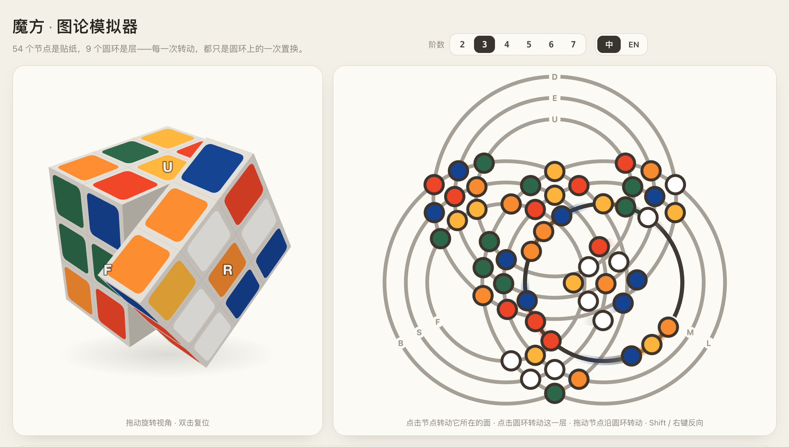
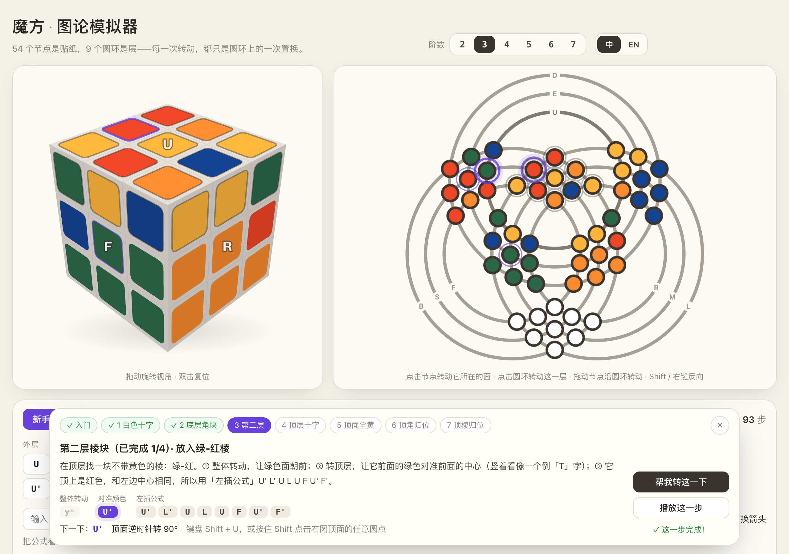
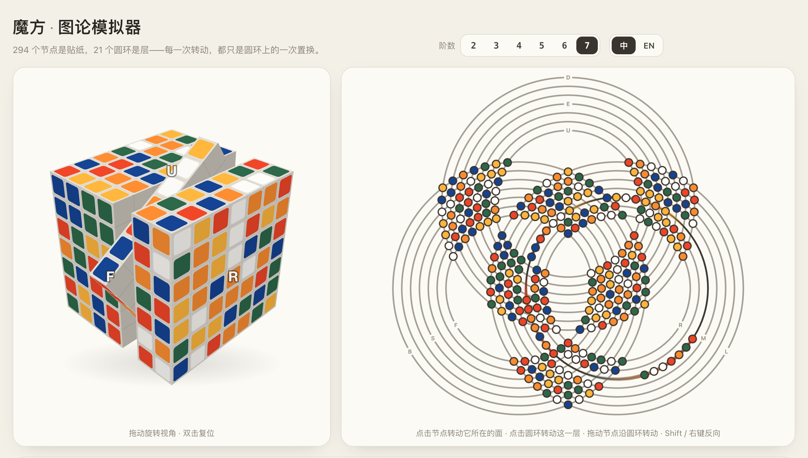
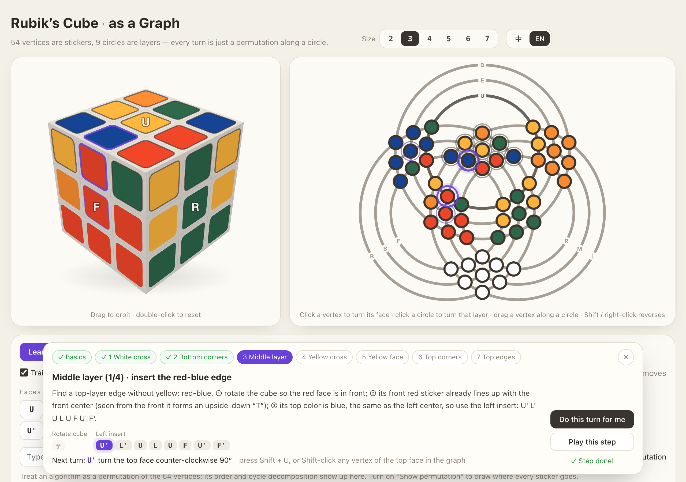

# 魔方 · 图论模拟器

**把魔方画成一张图：节点是贴纸，圆环是层——每一次转动，都只是圆环上的一次置换。**

在线体验：**https://linqizhe07.github.io/rubiks-graph-simulator/**　·　[新手教学](https://linqizhe07.github.io/rubiks-graph-simulator/?learn)　·　[5 阶](https://linqizhe07.github.io/rubiks-graph-simulator/?n=5)　·　[English](https://linqizhe07.github.io/rubiks-graph-simulator/?lang=en)



灵感来自 X 上 [@UnicornBitcoin 分享的一段动画](https://x.com/UnicornBitcoin/status/2107652690113339684)（「数学不愧是科学之王，用图论揭示魔方的底层逻辑」）。这个项目把动画里的那张图做成了可以交互的模拟器，三阶的几何比例按原视频逐帧测量还原：模型算出的 54 个节点位置与视频中检测到的节点平均相差 0.47 像素（视频宽 2160 像素）。

## 功能一览

- **2–7 阶任选**：右上角切换阶数，图和 3D 视图一起变；三阶与原视频完全一致，其它阶数按层数自动缩放圆间距和节点大小。
- **新手教学**（三阶·层先法）：从认识中心块、棱块、角块和转动记号开始，带你一步步还原。每一步都讲清楚为什么这样转、要转哪几下；下一下要转的层会在图上闪烁，要处理的块用紫圈标出。你可以自己转（转错了会按当前状态重新规划），也可以点「帮我转这一下」。
- **中文 / English**：右上角一键切换，所有面板、提示和教学讲解都有两种语言；会记住你的选择。
- **同步 3D 视图**：可拖动旋转视角，双击复位；悬停某个圆环时，3D 视图会描出对应的层。
- **公式实验室**：支持 `R U' F2`、宽层 `Rw` / `3Rw` / `r`、内层 `2R`、中层 `M E S`（奇数阶）、整体转动 `x y z`、括号重复 `(R U)6`、交换子 `[R, U]`、共轭 `[F: R U R' U']`；显示步数、阶数、循环分解，可在图上画出置换箭头，或一键「重复至复原」。
- **高帧率**：动画按时间戳驱动，跑满屏幕刷新率（60 / 120 / 144Hz）。

## 新手教学



| 章节 | 学什么 | 用到的公式 |
|---|---|---|
| 入门 | 两个视图、中心 / 棱 / 角、记号 R R′ U U′，动手练右手公式 | `R U R' U'` |
| 1 白色十字 | 一块一块把白色棱翻到顶层，再对准颜色转下去 | 直觉，`F2` 等 |
| 2 底层角块 | 角块转到目标位置正上方，重复右手公式 | `R U R' U'` × n |
| 3 第二层 | 找不带黄色的棱，对准颜色后左插或右插 | `U R U' R' U' F' U F` / `U' L' U L U F U' F'` |
| 4 顶层十字 | 点 → L 形 → 一字形 → 十字 | `F R U R' U' F'` |
| 5 顶面全黄 | 小鱼公式，按规则摆好再做 | `R U R' U R U2 R'` |
| 6 顶角归位 | 找「车灯」放到后面 | `R' F R' B2 R F' R' B2 R2` |
| 7 顶棱归位 | 完整的一面放到后面，三棱换 | `R U' R U R U R U' R' U' R2` |

教学的每一步由求解器根据当前状态实时规划（`js/solver.js`），所以无论你是跟着做、自己乱转，还是从自己打乱的魔方开始，都能接着教下去。

## 这张图是怎么来的

| | |
|---|---|
| **圆环 = 层** | N 阶魔方有 3 个转轴、每轴 N 层，共 3N 个可转动的层。同一转轴的 N 层画成 N 个**同心圆**；三组同心圆的圆心构成一个等边三角形。 |
| **节点 = 贴纸** | 每张贴纸恰好属于两个层（与所在面平行的两个方向），所以画在这两个圆的**交点**上。两组同心圆 N×N 两两相交，交出两块 N×N 点阵——正好是一对相对的面。 |
| **面的位置** | R、U、F 位于各自那组同心圆的**圆心**（内三角），它们的对面 L、D、B 在外侧。最内圈正是圆心那个面所在的层，所以转 R 时，整个内圈连同圆心的 R 面一起像表盘一样转动。 |
| **转动 = 置换** | 转一层 = 这个圆上的 4N 个节点沿圆走过「一个面」（N 个节点），其中 N 个节点会穿过圆上没有节点的那段空白弧；外层转动时，圆心处或对侧的那个面再原地转 90°。 |

几个可以在页面里验证的事实：

- 3N 个圆 × 每圆 4N 个节点 = 6N² 个节点 × 每点 2 个圆；
- 每个面在图上都是「从外面看」的方向：点击任意一个面的节点，它都按顺时针转；
- 三阶魔方群就是这 9 个圆生成的置换群，共 43,252,003,274,489,856,000 个状态；
- `R U` 的阶是 105，`R U R' U'` 的阶是 6，T 置换是 5 个对换——在公式实验室里输入即可看到。



## 操作

- **点击节点**：转动它所在的面（顺时针），Shift / 右键为逆时针；
- **点击圆环**：沿屏幕顺时针转动这一层；
- **拖动节点**：沿经过它的两个圆中、与拖动方向更一致的那个转动；
- **键盘**：`U D L R F B` 外层、`M E S` 中层（奇数阶）、`X Y Z` 整体转动，加 `Shift` 逆时针；先按数字再按字母转内层（`2` `R` = 2R）；`Ctrl/⌘+Z` 撤销、`Ctrl/⌘+Shift+Z` 重做；
- **网址参数**：`?n=5` 打开 5 阶，`?learn` 直接进入新手教学，`?lang=en` 英文界面。

## 高帧率

- 所有动画都由 `requestAnimationFrame` 的时间戳驱动，与帧率无关：60Hz、120Hz、144Hz 屏幕都会跑满刷新率，掉帧也不会变慢。
- 背景和灰色圆环预渲染到离屏画布，每帧一次 `drawImage`；节点按颜色预渲染成精灵图。
- 拖尾由动画参数解析计算（不依赖历史帧），颜色字符串全部预先缓存，渲染循环里几乎不分配内存。
- 3D 视图是无依赖的 Canvas 2D 软渲染：转动时沿转轴把魔方切成几块实心长方体，按远近逐块绘制，每帧只画外表面和切面，任何阶数都不会穿插。
- 实测负担最重的一帧（7 阶整体转动，294 个节点同时带拖尾运动，外加 3D 视图）平均 0.8 毫秒；三阶通常不到 1 毫秒。空闲时不重绘。

## 本地运行

纯静态页面，没有任何依赖，也不需要构建。直接打开 `index.html` 即可，或者起一个静态服务器：

```bash
python3 -m http.server 8000
```

然后访问 http://localhost:8000 。

## 测试

```bash
npm test
```

28 个测试（Node 18+，无需安装依赖），覆盖：

- 2–7 阶的魔方模型：每层转动都是双射且阶为 4、记号的显示与解析互逆、宽层 / 内层 / 整体转动的等价关系、经典公式的阶数；
- 2–7 阶的图：每个圆恰好经过 4N 个节点、每个节点恰好在 2 个圆上、节点互不重叠、动画路径终点就是置换后的位置、三阶几何与参考视频一致；
- 层先法求解器：300 个随机打乱全部还原，阶段只前进不后退，每阶段步数在新手方法的上限内，中途乱转也能重新规划；
- 中英文：两份词典的键与占位符一致，所有讲解在两种语言下都能完整渲染。

## 项目结构

```
index.html            页面
css/style.css         样式
js/i18n.js            中英文文案
js/cube.js            N 阶魔方模型：6N² 个贴纸槽位，每步转动是一个置换；记号解析、阶数、循环分解
js/graph.js           图的几何：圆心、半径、节点 = 圆的交点；转动时每个节点的运动路径
js/solver.js          三阶层先法的分步求解与讲解
js/graph-view.js      图论视图渲染（Canvas 2D）
js/cube3d-view.js     3D 魔方渲染（Canvas 2D 软渲染）
js/tutorial.js        新手教学面板
js/app.js             阶数切换、动画队列、交互、主循环
test/                 node:test 单元测试
```

---

## English

**The Rubik’s cube as a graph.** Live demo: **https://linqizhe07.github.io/rubiks-graph-simulator/?lang=en**



The stickers are vertices and the layers are circles. Layers of the same axis are concentric circles, and the three families are centered on the vertices of an equilateral triangle. Each sticker belongs to exactly two layers, so it sits where those two circles intersect. Turning a layer moves its 4N vertices one face along the circle, and turning an outer layer also spins the face at its center. The 3×3 geometry was measured frame by frame from the [original animation](https://x.com/UnicornBitcoin/status/2107652690113339684).

- **Any size from 2×2 to 7×7**, with a synchronized 3D view.
- **Beginner tutorial (3×3, layer by layer)**: it starts with the pieces and the notation, then guides you through the 7 stages. Each step explains why, lists the moves, and blinks the next layer to turn. Turn it yourself (it re-plans if you go off script) or press “Do this turn for me”.
- **中文 / English**: the whole interface, including every tutorial explanation, switches language with one click.
- **Algorithm lab**: big-cube notation (`Rw`, `3Rw`, `2R`), commutators, conjugates, order and cycle structure, permutation arrows.
- **High frame rate**: time-based animation at the display’s full refresh rate, with zero dependencies (Canvas 2D).

Open `index.html` or serve the folder with any static server. URL options: `?n=5`, `?learn`, `?lang=en`. Run the tests with `npm test`.

## License

[MIT](LICENSE)
